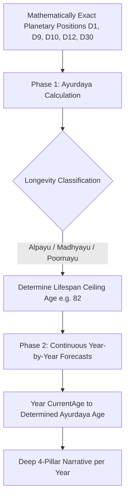

# Design Specification: Ayurdaya Determination & Deep Yearly Lifetime Forecasts

## 1. Overview & Objectives
This specification refines the AI Life Balan engine to provide astrologically precise, personalized lifetime forecasts based on classical Vedic **Ayurdaya (ஆயுள் நிர்ணயம்)** principles, while decluttering the yearly card UI by removing static pill tags and removing artificial character caps on yearly narrative forecasts.

### Key Deliverables:
1. **Yearly Card UI Cleanup**: Remove the 3 static indicator tags (`Career & Wealth`, `Health & Vitality`, `Family & Marriage`) from year-wise prediction cards in `AiPredictionsView.jsx`.
2. **Ayurdaya (Longevity Determination) Engine**: Instruct Gemini to systematically evaluate the native's longevity tier (*Alpayu* 0–32, *Madhyayu* 33–66/72, *Poornayu* 72–100+) using Lagna lord, 8th lord, Ayushkaraka Saturn, 3rd house, 8th house, and Maraka/Badhaka dasas, establishing a concrete lifespan ceiling.
3. **Continuous Forecast Generation up to Ayurdaya Age**: Generate year-by-year predictions from current year/age continuously through the determined Ayurdaya lifespan age.
4. **Deep Multi-Dimensional Narrative Depth**: Provide comprehensive, unconstrained narrative synthesis across career, wealth, health, marriage, progeny, and parental wellbeing.

---

## 2. Astrological & Technical Architecture

### 2.1 Classical Ayurdaya Analysis in Gemini Prompt
In `GeminiPredictionService.java`, the system instruction and astrological prompt will be upgraded to mandate a Two-Phase Ayurdaya Evaluation:



#### Astrological Rules Enforced in Prompt:
1. **Lagna & 8th Lord Dignity**: Relationship and exaltation/debilitation/combustion status of Lagna lord, 8th lord, and Saturn.
2. **Dusthana & Maraka Timing**: Identify critical Maraka periods (2nd and 7th houses) and D30 afflictions.
3. **Ayurdaya Longevity Summary**: Output concise determination (e.g., `பூர்ணாயுள் (Poornayu: ~80-84 வயது) - லக்னாதிபதி பலம் மற்றும் சனியின் சுப பார்வை`) inside `healthAnalysis.longevityVitalitySummary`.
4. **Lifespan Range**: Predictions generated from `currentYear` (Age `currentAge`) through the exact calculated lifespan age.

### 2.2 Yearly Card UI Modernization (`AiPredictionsView.jsx`)
- Remove the static `<div>` containing the 3 pill tags:
  ```jsx
  {/* REMOVED: Quick Domain Indicator Pill Tags */}
  ```
- Retain the clean card layout:
  - Header: Year + Age + Active Dasa-Bhukthi Badge
  - Yearly Theme Headline (🎯)
  - Detailed Unified Narrative Paragraph
  - Astrological Planetary Basis (🪐)
  - Cautions & Vedic Remedies (⚠️)

### 2.3 Comprehensive Multi-Dimensional Narrative Structure
Each year's `detailedPrediction` will provide rich, unconstrained paragraphs covering:
- **Career, Business & Finances**: Job promotions, business ventures, financial surges, property/vehicle acquisitions, investment timing.
- **Physical Health & Vitality**: Concrete physical health conditions, vulnerable organs, surgical alerts during malefic periods, vitality recovery phases.
- **Marriage, Family & Progeny**: Domestic harmony, marital milestones, children's birth/education/career achievements.
- **Parents, Elders & Mindset**: Father/mother wellbeing (D12), elder care, bereavement warnings when Maraka/8th/12th dasas are running, spiritual growth.

---

## 3. Data Schema Consistency

The response schema in `GeminiPredictionService.java` remains backwards-compatible with `PredictionResponseDTO`:
```json
{
  "overallSummary": "...",
  "nativePersonality": { ... },
  "healthAnalysis": {
    "ayurvedicConstitution": "...",
    "organVulnerabilities": ["..."],
    "longevityVitalitySummary": "பூர்ணாயுள் (Poornayu: ~80-84 வயது) - லக்னாதிபதி குரு பார்வை மற்றும் 8-ம் அதிபதி பலம் காரணமாக தீர்க்காயுள்.",
    "recommendedDietAndLifestyle": ["..."]
  },
  "aiYogas": [ ... ],
  "aiDoshams": [ ... ],
  "pastKeyPhases": [ ... ],
  "lifetimePredictions": [
    {
      "year": 2026,
      "age": 31,
      "dasaBhukthi": "சனி - புதன்",
      "yearlyTheme": "தொழில் மற்றும் பொருளாதாரத்தில் புதிய திருப்பம்",
      "detailedPrediction": "...",
      "astrologicalBasis": "...",
      "cautionsAndRemedies": "..."
    }
  ]
}
```

---

## 4. Verification Plan
- **Frontend Build**: `npm run build` verifies JSX cleanliness and bundle integrity.
- **Automated Backend Tests**: `mvn test -Dtest=GeminiPredictionServiceTest,PredictionCacheServiceTest` tests prompt generation with Ayurdaya directives.
- **Full Test Suite**: `mvn test` verifying all 44 unit and integration tests.
