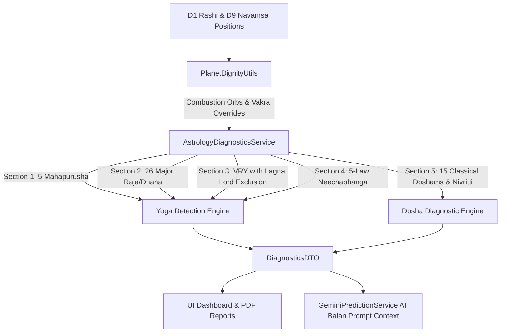

# Unified Master Specification Design: Vedic Astrological Yogas, Doshams, Nullifications & Engine Laws

## 1. Objective
Achieve 100% deterministic mathematical accuracy across all classical Vedic Astrological **Yogas (26 Major Types)**, **Doshams (15 Classical Types with Complete Nivritti/Nullification Rules)**, **Moudhya (Combustion) Exact Orbs**, and **Vakra (Retrograde) Dignity Overrides** per *Brihat Parasara Hora Shastra (BPHS)* and classical authorities.

---

## 2. Architectural Components

### Component Boundaries & Responsibilities

1. **`PlanetDignityUtils.java`**:
   * Exact degree distance combustion evaluator:
     * Moon $\le 12^\circ$
     * Mars $\le 17^\circ$
     * Mercury $\le 14^\circ$ (Direct) / $\le 12^\circ$ (Retrograde)
     * Jupiter $\le 11^\circ$
     * Venus $\le 10^\circ$ (Direct) / $\le 8^\circ$ (Retrograde)
     * Saturn $\le 15^\circ$
   * Retrograde dignity evaluation (Debilitated + Retrograde $\rightarrow$ *Uchcha-Sama Bala*; Exalted + Retrograde $\rightarrow$ *Sama Bala*).
   * Functional house classification helpers: `isKendra(h)`, `isTrikona(h)`, `isUpachaya(h)`, `isDusthana(h)`.

2. **`AstrologyDiagnosticsService.java`**:
   * **Section 1: Pancha Mahapurusha Yogas**:
     * Ruchaka (Mars), Bhadra (Mercury), Hamsa (Jupiter), Malavya (Venus), Sasa (Saturn).
     * Must be in Kendra ($1, 4, 7, 10$) from Janma Lagna, in Own/Exalted sign, and `!isCombust`.
     * Upachaya exclusion: 11th house placement strictly classified as *Swakshetra Dhana Yoga*, not Ruchaka.
   * **Section 2: 26 Major Raja, Dhana & Classical Yogas**:
     1. *Dharma-Karmadhipati Yoga*: 9th and 10th lords in conjunction or mutual 7th aspect in Kendra/Trikona. Cancelled if combust or in Dusthanas.
     2. *Budhaditya Yoga*: Sun & Mercury in exact same Rashi without combustion.
     3. *Gajakesari Yoga*: Jupiter in Kendra from Moon without debilitation/combustion.
     4. *Chandra-Mangala Yoga*: Moon & Mars conjunction or mutual 7th aspect.
     5. *Lakshmi Yoga*: 9th Lord in Kendra/Trikona in Own/Exalted sign + strong Lagna Lord.
     6. *Bhagyalakshmi Yoga*: 9th Lord in Kendra/Trikona in Own/Exalted sign, and Jupiter & Venus simultaneously in Kendra/Trikona. Cancelled if combust or in 6/8/12.
     7. *Rajalakshmi Yoga*: Jupiter, Venus, Mercury, Moon all in Kendra/Trikona without malefic affliction; or 9th & 10th lords in 1st/5th with Venus/Jupiter in Kendra.
     8. *Amala Yoga*: Natural benefic in 10th from Lagna or Moon without malefic occupation/aspect.
     9. *Solar Yogas*: Vesi (benefics in 2nd from Sun), Vosi (benefics in 12th from Sun), Obhayachari (both).
     10. *Lunar Yogas*: Sunapha (2nd from Moon), Anapha (12th from Moon), Dhurudhura (both).
     11. *Kemadruma Yoga*: Isolated Moon; Kemadruma Bhanga cancellation if planet in Kendra from Lagna or Jupiter/Venus aspects Moon.
     12. *Adhi Yoga (Chandradi / Lagnadhi)*: Benefics in 6th, 7th, 8th from Moon or Lagna.
     13. *Vasumathi Yoga*: Benefics in Upachaya houses (3, 6, 10, 11) from Lagna or Moon.
     14. *Akhanda Samrajya Yoga*: Fixed or Movable Lagna, Jupiter ruling 2/5/11 in Kendra from Lagna/Moon, and 2/9/11 lord in Kendra from Moon. Dual lagnas excluded.
     15. *Saraswati Yoga*: Jupiter, Venus, Mercury in Kendra/Trikona/2nd, Jupiter in Own/Exalted/Friendly sign without debilitation.
     16. *Kalanidhi Yoga*: Jupiter in 2nd or 5th conjunct/aspected by both Mercury and Venus.
     17. *Kahala Yoga*: 4th and 9th lords in mutual Kendras with strong Lagna Lord.
     18. *Parvata Yoga*: Benefics in Kendras, Dusthanas (6, 8) vacant or strictly benefic.
     19. *Pushkala Yoga*: Moon dispositor conjunct Lagna Lord in Kendra/Trikona and aspecting Lagna.
     20. *Shakata Yoga*: Moon in 6/8/12 from Jupiter; Shakata Bhanga if Moon in Kendra from Lagna, conjunct/aspected by Mars, or Jupiter in Own/Exalted sign.
     21. *Shubhakarthari Yoga*: Benefics in 2nd and 12th from Lagna, Moon, or 10th house.
     22. *Mahabhagya Yoga*: Male daytime birth with Lagna/Sun/Moon in odd signs; Female nighttime birth with Lagna/Sun/Moon in even signs.
     23. *General Kendra-Trikona Sambandha Yoga*: Kendra and Trikona lords in sambandha.
     24. *Chamara Yoga*: Lagna Lord exalted in Kendra aspected by Jupiter; or two benefics in 7/9/10.
     25. *Pravrajya / Sanyasa Yoga*: 4+ planets in a single house.
     26. *Parivartana Yogas*: Maha (Kendra/Trikona exchange), Khala (3rd lord exchange), Dainya (6/8/12 Dusthana exchange).
   * **Section 3: Vipareeta Raja Yoga (VRY)**:
     * Harsha (6th in 6/8/12), Sarala (8th in 6/8/12), Vimala (12th in 6/8/12).
     * **Lagna Lord Exclusion**: Mars for Aries/Scorpio and Venus for Taurus/Libra in 6/8/12 strictly excluded from VRY (*Lagnathipathi Maraivu*).
     * **Benefic Nullification**: Cancelled if conjunct/aspected by Jupiter or Venus.
   * **Section 4: Neechabhanga Raja Yoga (5 Classical Laws)**:
     1. Dispositor in Kendra from Lagna or Moon.
     2. Exaltation lord in Kendra from Lagna or Moon.
     3. Aspected by or conjunct dispositor/exaltation lord.
     4. Exalted companion in the same sign.
     5. Navamsa (D9) Exaltation upgrade.
   * **Section 5: 15 Classical Doshams & Nullifications**:
     1. *Sevvai / Kuja Dosha*: Triple reference frame (Lagna, Moon, Venus) with full classical nullifications (Cancer/Leo Yogakaraka exemption, 11th Upachaya, Own/Exalted/Cancer debilitation, Jupiter/Venus aspects, Chandra-Mangala, house-sign pairs).
     2. *Kalasarpa & Kalamrita Dosha*: Degree-level longitude enclosure check + Jupiter aspect & Upachaya exemptions.
     3. *Sarpam / Nodal Dosham*: Nodes in 1, 2, 5, 7, 8 with Upachaya 3/6/11 and Jupiter/Venus aspect nullifications.
     4. *Pitru Dosha*: Sun afflictions with Jupiter aspect and exaltation exemptions.
     5. *Putra Dosha*: 5th house afflictions with Jupiter aspect and 5th lord dignity exemptions.
     6. *Kalathra Dosha*: 7th house afflictions with Venus/Jupiter protections.
     7. *Shani Dosha*: 7th/8th Saturn with Sasa Yoga and Yogakaraka exemptions.
     8. *Guru-Chandala Dosha*: Jupiter-Rahu/Ketu with 5th/9th Gyan Yoga conversion.
     9. *Angarak Dosha*: Mars-Rahu/Ketu with 3/6/11 Upachaya Shatru Jaya conversion.
     10. *Punarphoo Dosha*: Saturn-Moon connection with Purnima and Jupiter aspect cancellations.
     11. *Papakarthari Dosha*: Malefics in 2nd and 12th from Lagna, Moon, or 10th.
     12. *Grahan Dosha*: Sun/Moon conjunct Rahu/Ketu within $12^\circ$ orb.
     13. *Daridra Yoga*: 11th Lord in 6, 8, 12 without VRY.
     14. *Duryoga*: 10th Lord in 6, 8, 12 without VRY.
     15. *Sarpa Dosha*: Malefics in 3-4 Kendras with no benefics in Kendras.
     16. *Maraka Dasha Edge Cases*: Cancer/Leo Yogakaraka Mars override.

---

## 3. Data Flow & Integration

1. `ChartOrchestrationService` calculates D1 and D9 positions.
2. `AstrologyDiagnosticsService` processes all 26 Yogas and 15 Doshams, returning `DiagnosticsDTO`.
3. `GeminiPredictionService` injects verified Yogas and active Doshams into the AI Balan prompt context.
4. UI Dashboard and PDF export render localized results.

---

## 4. Verification Plan
* Create `AstrologyDiagnosticsServiceTest.java` with test cases verifying each yoga, dosham, and edge case.
* Run full Maven test suite (`mvn test`) to ensure all existing and new tests pass.
* Verify frontend build (`npm run build`).
