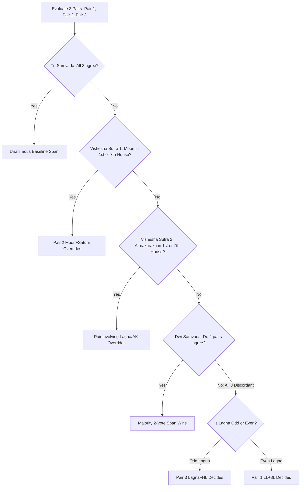

# Classical Jaimini Ayurdaya 3-Pair Matrix, Shoola Dasa & Longevity Engine Design

## 1. Executive Summary & Problem Statement

### 1.1 Context
In the existing codebase, `AyurdayaCalculationUtils.java` provides a preliminary calculation of longevity using basic 3 pairs and rudimentary adjustments. However, authentic Vedic Jaimini Ayurdaya (*Jaimini Upadesha Sutras* Adhyaya 2, Pada 1 and *Brihat Parashara Hora Shastra* Ch. 44–45) requires a comprehensive ruleset:
1. **Rasi Swaroopa & Counting Direction**: Odd signs use Direct (*Savya*) counting while Even signs use Reverse (*Apasavya*) counting for 8th house calculation.
2. **Dual-Lordship Evaluation**: Scorpio (Mars vs Ketu) and Aquarius (Saturn vs Rahu) co-lord strength resolution.
3. **Vishesha Sutras (Special Overrides)**: Moon or Atmakaraka (AK) in 1st/7th house overriding standard majority consensus.
4. **Kakshya Vriddhi & Kakshya Hrasa**: Deterministic promotion and demotion rules across the 3 compartments (*Alpayu*, *Madhyayu*, *Poornayu*).
5. **Khanda Ayus 12-Year Sub-Tiers**: Sub-dividing the 36-year compartment into 12-year brackets (Lower, Middle, Upper).
6. **Jaimini Shoola Dasa Engine**: 9-year Rasi Mahadasas and 9-month Antardasas to pinpoint the *Trishoola* and *Rudra* mortality/critical-health windows.
7. **100+ Person Automated Verification Suite**: Testing all classical permutations across a minimum of 100 diverse charts to guarantee 100% computational accuracy, zero edge-case crashes, and rock-solid reliability.

---

## 2. Mathematical & Astrological Architecture

### 2.1 Rasi Swaroopa & Lordship Mechanics

#### A. Modality (Charadi Swaroopa)
- **Chara (Movable)**: Aries (1), Cancer (4), Libra (7), Capricorn (10)
- **Sthira (Fixed)**: Taurus (2), Leo (5), Scorpio (8), Aquarius (11)
- **Dwisvabhava (Dual)**: Gemini (3), Virgo (6), Sagittarius (9), Pisces (12)

#### B. Directional Counting (Savya / Apasavya)
For determining the Jaimini 8th house (*Ayur Bhava*):
- If Lagna is **Odd (Vishama)**: Count 8 signs zodiacally / forward:
  $$\text{Sign}_8 = ((LagnaSign + 7 - 1) \bmod 12) + 1$$
- If Lagna is **Even (Sama)**: Count 8 signs reverse / counter-clockwise:
  $$\text{Sign}_8 = ((LagnaSign - 7 - 1 + 12) \bmod 12) + 1$$

#### C. Dual-Lordship Resolution for Scorpio & Aquarius
- **Scorpio (Vrishchika)**: Co-ruled by **Mars** and **Ketu**.
- **Aquarius (Kumbha)**: Co-ruled by **Saturn** and **Rahu**.
- **Strength Evaluation Algorithm**:
  1. *Conjunction Count*: The planet conjoined with more planets in the same sign is stronger.
  2. *Dignity*: If tied, the planet in exaltation or own sign is stronger.
  3. *House Placement*: If tied, the planet in Kendra (1, 4, 7, 10) or Trikona (5, 9) is stronger.
  4. *Longitude*: If tied, the planet with higher degree in the sign is stronger.
  The winning planet is chosen as the active Lagna / 8th lord.

#### D. Precise Hora Lagna (HL)
Hora Lagna is calculated based on elapsed time from Sunrise:
- 1 sign (30°) per 2.5 ghatis (1 hour).
- If Sun's sign is Odd, count zodiacally; if Even, count in reverse (or Savana hourly progression from sunrise).

---

### 2.2 Trisutra Method: The 3 Canonical Pairs

1. **Pair 1**: Active Lagna Lord modality ($M_{LL}$) & Active 8th Lord modality ($M_{8L}$).
2. **Pair 2**: Moon modality ($M_{Moon}$) & Saturn modality ($M_{Saturn}$).
3. **Pair 3**: Lagna modality ($M_{Lagna}$) & Hora Lagna modality ($M_{HL}$).

#### The 3-Pair Modality Matrix
| Component 1 ($M_1$) | Component 2 ($M_2$) | Span Category | Age Span |
| :--- | :--- | :--- | :--- |
| **Chara (Movable)** | **Chara (Movable)** | **Poornayu** | 72 – 108 Years |
| **Chara (Movable)** | **Sthira (Fixed)** | **Madhyayu** | 36 – 72 Years |
| **Chara (Movable)** | **Dwisvabhava (Dual)** | **Alpayu** | 0 – 36 Years |
| **Sthira (Fixed)** | **Chara (Movable)** | **Madhyayu** | 36 – 72 Years |
| **Sthira (Fixed)** | **Sthira (Fixed)** | **Alpayu** | 0 – 36 Years |
| **Sthira (Fixed)** | **Dwisvabhava (Dual)** | **Poornayu** | 72 – 108 Years |
| **Dwisvabhava (Dual)** | **Chara (Movable)** | **Alpayu** | 0 – 36 Years |
| **Dwisvabhava (Dual)** | **Sthira (Fixed)** | **Poornayu** | 72 – 108 Years |
| **Dwisvabhava (Dual)** | **Dwisvabhava (Dual)** | **Madhyayu** | 36 – 72 Years |

---

### 2.3 Synthesis Rules & Vishesha Sutras (Priority Hierarchy)



1. **Tri-Samvada (3/3 Consensus)**: Complete agreement.
2. **Vishesha Sutra 1 (Chandra-Kendra Sutra)**: If Moon is in Lagna (1st) or 7th house, **Pair 2 (Moon + Saturn)** overrides all other pairs.
3. **Vishesha Sutra 2 (Atmakaraka Kendra Sutra)**: If Atmakaraka (AK) is in Lagna (1st) or 7th house, the pair involving Lagna/AK holds overriding authority.
4. **Dwi-Samvada (2/3 Majority)**: If no Vishesha override applies, the 2-pair majority consensus prevails.
5. **Asamvada (All 3 Pairs Differ: 1 Poorna, 1 Madhya, 1 Alpa)**:
   - If Moon in 1st/7th $\rightarrow$ Pair 2 decides.
   - If Odd Lagna $\rightarrow$ Pair 3 (Lagna + Hora Lagna) decides.
   - If Even Lagna $\rightarrow$ Pair 1 (Lagna Lord + 8th Lord) decides.

---

### 2.4 Kakshya Vriddhi & Kakshya Hrasa Engine

#### A. Kakshya Vriddhi (Longevity Increments / Promotion by 1 Tier)
- **Jupiter (Guru) Protection**: Jupiter in Lagna (1st), 7th house, or Kendras/Trikonas (1, 4, 7, 10, 5, 9) in strength $\rightarrow$ Promotes span tier (Alpayu $\rightarrow$ Madhyayu, Madhyayu $\rightarrow$ Poornayu, Poornayu $\rightarrow$ Paramayu / 100+ yrs).
- **Atmakaraka (AK) Dignity**: AK exalted or in Kendra/Trikona $\rightarrow$ Promotes span or adds +4 to +8 years.
- **Ayushkaraka Saturn in Dignity**: Saturn in own sign (Capricorn/Aquarius) or exalted (Libra) or 8th house in strength $\rightarrow$ Adds +4 to +8 years.
- **Natural Benefics in Kendras**: Jupiter, Venus, and unafflicted Mercury occupying Kendras $\rightarrow$ Increases vitality score.

#### B. Kakshya Hrasa (Longevity Decrements / Demotion by 1 Tier)
- **Saturn Debilitation**: Saturn in Aries (Sign 1) without Neechabhanga $\rightarrow$ Demotes span tier (Poornayu $\rightarrow$ Madhyayu, Madhyayu $\rightarrow$ Alpayu).
- **Lagna Lord Affliction**: Lagna Lord debilitated or combust in Dusthana (6, 8, 12) $\rightarrow$ Demotes span or applies -4 to -8 years reduction.
- **Papakarthari Yoga**: Malefics (Sun, Mars, Saturn, Rahu, Ketu) occupying both 12th and 2nd houses from Lagna or Moon $\rightarrow$ Applies -3 to -6 years reduction.
- **Malefics in Kendras**: Malefics occupying Kendras with no benefic relief $\rightarrow$ Vitality reduction.

#### C. Khanda Ayus (12-Year Sub-Tiers)
The 36-year compartment is divided into three 12-year sub-tiers (Lower, Middle, Upper):
- **Alpayu**: 0–12 yrs (Balarishta), 12–24 yrs (Madhyama Alpayu), 24–36 yrs (Uttama Alpayu)
- **Madhyayu**: 36–48 yrs (Adhama Madhyayu), 48–60 yrs (Madhyama Madhyayu), 60–72 yrs (Uttama Madhyayu)
- **Poornayu**: 72–84 yrs (Adhama Poornayu), 84–96 yrs (Madhyama Poornayu), 96–108 yrs (Paramayu / Deerghayu)
*The sub-bracket is refined using Navamsha Lagna and Navamsha Hora Lagna modalities.*

---

### 2.5 Jaimini Shoola Dasa Engine

#### A. Mechanics
1. **Starting Sign**: Determine whether Lagna (1st) or 7th house is stronger (based on planetary conjunctions, exaltation, lord aspect).
2. **Progression Order**:
   - If starting sign is **Odd (Vishama)** (Aries, Gemini, Leo, Libra, Sagittarius, Aquarius) $\rightarrow$ **Direct Order** ($1 \rightarrow 2 \rightarrow 3 \dots$).
   - If starting sign is **Even (Sama)** (Taurus, Cancer, Virgo, Scorpio, Capricorn, Pisces) $\rightarrow$ **Reverse Order** ($2 \rightarrow 1 \rightarrow 12 \dots$).
3. **Period Duration**:
   - Each Rasi Mahadasa lasts **exactly 9 years** ($12 \times 9 = 108$ years total).
   - Each Antardasa within a sign lasts **9 months** ($9 \text{ years} / 12 = 9 \text{ months}$).

#### B. Trishoola & Rudra Signs
- **Trishoola Signs**: The 1st, 5th, and 9th houses counted from the 8th house (representing destruction).
- **Rudra Sign**: The sign occupied by the **Rudra** planet (the stronger of the 2nd and 8th lords).
- **Critical Shoola Window**: The 9-year Shoola Dasa sign matching the Ayurdaya age bracket that coincides with a Trishoola sign, Rudra sign, or Maraka/Badhaka affliction.

---

### 2.6 Parashari Vimshottari Cross-Timing & Dual Confirmation
1. **Maraka Lords**: 2nd and 7th house lords and occupants.
2. **Badhaka Lord**: 11th for Chara, 9th for Sthira, 7th for Dwisvabhava Lagna.
3. **22nd Drekkana Lord (Kharesha)**: Middle decanate lord of the 8th house.
4. **Dual Alignment**: The system cross-references the 9-year Shoola Dasa window with the active Vimshottari Mahadasa/Bhukthi to present a unified, dual-confirmed cautionary window with tailored Vedic remedies.

---

## 3. Data Structures & API Schema

### 3.1 `AyurdayaProfile` Record
```java
public record AyurdayaProfile(
        String longevityClassification,       // e.g. "Poornayu"
        int estimatedLifespanCeiling,         // e.g. 84
        String lifespanRange,                 // e.g. "78 - 88 Years (~2073 - 2083)"
        String khandaSubTier,                 // e.g. "Adhama Poornayu (72 - 84 Years)"
        Map<String, Object> jaiminiThreePairs,// 3-Pair breakdown, raw votes & applied Vishesha Sutras
        Map<String, Object> kakshyaAnalysis,  // Breakdown of all Vriddhi / Hrasa promotions & reductions
        Map<String, Object> shoolaDasaInfo,   // 9-year Shoola Dasa table + Trishoola & Rudra signs
        Map<String, Object> parasharaAyurBala,// Sarira Bala, Jeeva Bala, Ayushkaraka Bala & Yogas
        Map<String, Object> marakaTimeline,   // Maraka 2nd/7th, Badhaka, 22nd Drekkana & Bhukthi window
        List<String> kakshyaAdjustments,      // List of adjustment reason strings
        String criticalMarakaWindow,          // Formatted critical window string
        String classicalRationale             // Step-by-step narrative explaining each calculation
) {}
```

---

## 4. Verification & 100+ Chart Test Suite

### 4.1 Test Automation Strategy
An automated test suite (`AyurdayaBenchmark100Test.java`) will execute and validate across **100+ diverse natal charts**:

1. **All 12 Lagnas**: Aries through Pisces with Odd and Even directional counting verification.
2. **Dual-Lordship Permutations**:
   - Scorpio Lagna/8th house with Mars stronger vs Ketu stronger.
   - Aquarius Lagna/8th house with Saturn stronger vs Rahu stronger.
3. **Vishesha Sutra Edge Cases**:
   - Moon in Lagna (1st) overriding dissenting pairs.
   - Moon in 7th house overriding dissenting pairs.
   - Atmakaraka in Lagna/7th house overriding dissenting pairs.
4. **Kakshya Vriddhi & Hrasa Permutations**:
   - Full promotion from Alpayu $\rightarrow$ Madhyayu $\rightarrow$ Poornayu.
   - Demotion from Poornayu $\rightarrow$ Madhyayu $\rightarrow$ Alpayu with debilitated Saturn.
   - Neechabhanga cancellation preventing demotion.
   - Papakarthari Yoga triggering Hrasa.
5. **Shoola Dasa Invariants**:
   - Total period duration across 12 signs = exactly 108 years.
   - Correct direct vs reverse ordering based on odd/even starting sign.
   - Proper tagging of Trishoola and Rudra signs.
6. **Robustness & Determinism**:
   - Zero `NullPointerException`s on missing or partial planetary data.
   - 100% deterministic results across multiple runs.

---

## 5. UI Integration

- **Health & Longevity View (`HealthLongevityView.jsx`)**:
  - Render the **3-Pair Modality Table** showing each pair, signs, modalities, and individual span outcomes.
  - Render the **Applied Synthesis & Overrides Card** (highlighting when Vishesha Sutras or majority rules triggered).
  - Render the **Kakshya Adjustments Breakdown** (itemizing each Vriddhi increment and Hrasa decrement with classical rationale).
  - Render the **Jaimini Shoola Dasa Timeline Table** (highlighting Trishoola and critical 9-year windows).
  - Render the **Parashari Vimshottari & Remedial Guidance**.
