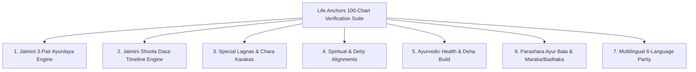

# Classical Life Anchors & Longevity End-to-End 100-Chart Audit & Verification Design

**Date**: 2026-09-01  
**Status**: APPROVED  
**Scope**: Jaimini Ayurdaya, Shoola Dasa, Special Lagnas (AL/UL/GL/HL), Chara Karakas, Spiritual Deities, Ayurvedic Doshas & Deha Build, Parashara Ayur Bala, and 6-Language Multilingual Parity across $\ge 100$ Charts.

---

## 1. Executive Summary

This specification establishes an exhaustive, deterministic cross-verification suite for the **Life Anchors & Longevity** system in `java-astro`. The suite validates classical astrological invariants from *Maharishi Jaimini's Upadesha Sutras*, *Brihat Parashara Hora Shastra (BPHS)*, and classical Ayurvedic texts across **100 distinct birth charts** (90 parameterized synthetic edge-case charts + 10 historical classical benchmark natives).

---

## 2. Scope of Verified Modules

### Module Breakdown
1. **Jaimini 3-Pair Ayurdaya Engine** (`AyurdayaCalculationUtils.java`)
2. **Jaimini Shoola Dasa Engine** (`ShoolaDasaCalculationUtils.java`)
3. **Special Lagnas & Chara Karakas** (`StructuralAnchorsUtils.java`, `PlanetDignityUtils.java`)
4. **Spiritual Deities Engine** (`SpiritualDeityUtils.java`)
5. **Ayurvedic Health & Deha Build** (`AyurvedicHealthUtils.java`)
6. **Parashara Ayur Bala & Maraka Timeline** (`AyurdayaCalculationUtils.java`)
7. **Frontend & Translation Layer** (`LifeAnchorsLongevityView.jsx`, `HealthLongevityView.jsx`, `translations.js`, `AstrologicalTranslationHelper.java`, `messages_*.properties`)

---

## 3. Classical Rules & Mathematical Invariants

### A. Jaimini 3-Pair Modality Synthesis
Every chart must evaluate three independent pairs to assign a baseline longevity compartment:
1. **Pair 1**: Lagna Lord + 8th Lord
2. **Pair 2**: Moon + Saturn (Ayushkaraka)
3. **Pair 3**: Lagna + Hora Lagna

**Modality Combination Matrix**:
- Chara + Chara $\rightarrow$ **Deerghayu / Poornayu** (75–100+ years)
- Chara + Sthira $\rightarrow$ **Madhyayu** (36–75 years)
- Chara + Dwisvabhava $\rightarrow$ **Alpayu** (0–35 years)
- Sthira + Sthira $\rightarrow$ **Alpayu** (0–35 years)
- Sthira + Chara $\rightarrow$ **Madhyayu** (36–75 years)
- Sthira + Dwisvabhava $\rightarrow$ **Deerghayu / Poornayu** (75–100+ years)
- Dwisvabhava + Dwisvabhava $\rightarrow$ **Madhyayu** (36–75 years)
- Dwisvabhava + Chara $\rightarrow$ **Alpayu** (0–35 years)
- Dwisvabhava + Sthira $\rightarrow$ **Deerghayu / Poornayu** (75–100+ years)

**Synthesis Hierarchy & Vishesha Sutras**:
- **Tri-Samvada**: If all 3 pairs indicate the same compartment $\rightarrow$ Unanimous consensus.
- **Dwi-Samvada**: If 2 of 3 pairs agree $\rightarrow$ Majority consensus.
- **Vishesha Sutra 1 (Chandra-Kendra, *Jaimini Sutra* 2.1.23)**: If Moon is in Lagna (1st house) or 7th house from Lagna $\rightarrow$ **Pair 2 (Moon + Saturn)** holds overriding authority.
- **Vishesha Sutra 2 (Atmakaraka-Kendra, *Jaimini Sutra* 2.1.24)**: If Atmakaraka (AK) is in Lagna (1st) or 7th and Moon is not in Kendra $\rightarrow$ **Lagna-AK** pair holds authority.
- **Asamvada (All 3 differ, *Jaimini Sutra* 2.1.25)**:
  - Odd Lagna (Mesha, Mithuna, Simha, Tula, Dhanus, Kumbha) $\rightarrow$ **Pair 3 (Lagna + Hora Lagna)**.
  - Even Lagna (Vrishabha, Kataka, Kanya, Vrishchika, Makara, Meena) $\rightarrow$ **Pair 1 (Lagna Lord + 8th Lord)**.

### B. Kakshya Vriddhi & Kakshya Hrasa (Tier Adjustments)
- **Kakshya Vriddhi (+4 years or Tier Elevation)**:
  - Benefic Jupiter in Kendra (1, 4, 7, 10) or Trikona (5, 9) with strong dignity.
  - Atmakaraka in Kendra/Trikona or Exalted.
  - Ayushkaraka Saturn in Own sign (Makara/Kumbha) or Exalted (Tula).
- **Kakshya Hrasa (-4 years or Tier Reduction)**:
  - Saturn debilitated (Mesha) without Neecha Bhanga.
  - Lagna Lord debilitated in Dusthana (6, 8, 12).
  - Malefics in 12th & 2nd from Lagna/Moon (Papakarthari).
  - Malefics in Kendras with zero benefics in Kendras.
- **Span Bounds**: Final lifespan estimate must remain bounded strictly in $[0, 120]$ years.

### C. Jaimini Shoola Dasa 108-Year Timeline
- **Mahadasas**: Exactly 12 Mahadasas of **9 years each** ($12 \times 9 = 108$ total years).
- **Antardasas**: Exactly 12 Antardasas of **9 months each** per Mahadasa ($12 \times 9\text{ mo} = 108\text{ mo} = 9\text{ yrs}$).
- **Progression**:
  - Direct (zodiacal) if starting sign is Odd.
  - Reverse (anti-zodiacal) if starting sign is Even.
- **Trishoola Signs**: 1st, 5th, and 9th signs from the starting anchor / 8th house.
- **Rudra Sign**: Stronger sign between 8th and 2nd from Lagna.

### D. Special Lagnas & Chara Karakas
- **Arudha Lagna (AL)**: $\text{Lagna} + (\text{Lagna} - \text{LagnaLord})$ with 10th-house exception if falling in 1st/7th.
- **Upapada Lagna (UL)**: $12\text{th} + (12\text{th} - 12\text{th Lord})$ with 10th-house exception if falling in 12th/6th.
- **Ghatika Lagna (GL) & Hora Lagna (HL)**: Computed from sunrise and birth time.
- **Chara Karakas (7-Karaka System)**: Strictly ranked by longitudinal degree in sign ($0^\circ \text{ to } 30^\circ$):
  $$\text{AK} > \text{AmK} > \text{BK} > \text{MK} > \text{PK} > \text{GK} > \text{DK}$$

### E. Spiritual Deities & Ayurvedic Health
- **Ishta Devata**: 12th from Karakamsa in D9.
- **Dharma Devata**: 9th from Karakamsa in D9.
- **Palana Devata**: 6th from Amatyakaraka in D9.
- **Ayurvedic Doshas**: $\text{Vata}\% + \text{Pitta}\% + \text{Kapha}\% = 100\%$, with primary dosha correctly driving Deha Build assignment (*Krisa*, *Madhya*, *Sthula*, or *Sama*).

---

## 4. Test Dataset Specification (100 Charts)

### A. 90 Parameterized Synthetic Charts
1. **Lagna Modality Permutations (36 charts)**: 12 Lagnas $\times$ all 3 modality combinations for Pair 1, Pair 2, Pair 3.
2. **Vishesha Sutra Override Cases (24 charts)**:
   - 6 charts: Chandra in Lagna (1st house).
   - 6 charts: Chandra in 7th house.
   - 6 charts: AK in Lagna/7th (with Moon elsewhere).
   - 6 charts: Asamvada odd/even tie-breakers.
3. **Dual Lord Resolution (10 charts)**:
   - 5 charts: Vrishchika (Mars vs Ketu).
   - 5 charts: Kumbha (Saturn vs Rahu).
4. **Kakshya Adjustments (20 charts)**:
   - Multi-Vriddhi combinations (Jupiter + AK + Saturn strong).
   - Multi-Hrasa combinations (Saturn debilitated + Papakarthari + Dusthana Lagna Lord).
   - Neecha Bhanga cancellation edge cases.

### B. 10 Classical Historical Natives
1. **Swami Vivekananda** (1863-01-12, Dhanus Lagna, Alpayu/Madhyayu transitions, Atmakaraka Sun).
2. **B.V. Raman** (1912-08-08, Kumbha Lagna, Saturn in 4th, Deerghayu).
3. **Mahatma Gandhi** (1869-10-02, Tula Lagna, Mars+Mercury+Venus in Lagna).
4. **Albert Einstein** (1879-03-14, Mithuna Lagna, exalted Venus).
5. **Sri Ramana Maharshi** (1879-12-30, Tula Lagna, Moon in Punarvasu).
6. **Sri Ramakrishna Paramahamsa** (1836-02-18, Kumbha Lagna, exalted Mars).
7. **Rabindranath Tagore** (1861-05-07, Meena Lagna, Jupiter in 5th).
8. **Indira Gandhi** (1917-11-19, Kataka Lagna, Saturn in Lagna).
9. **Jawaharlal Nehru** (1889-11-14, Kataka Lagna, Moon in Lagna).
10. **Srinivasa Ramanujan** (1887-12-22, Kumbha Lagna, Mercury in 10th).

---

## 5. Multilingual & Frontend Parity Verification

Across all 100 charts, the suite validates:
1. **Zero Unlocalized Strings**: All terms (`lagnaLordStrength`, `vitalityScore`, `dehaPrakriti`, `deityNames`, `khandaSubTier`, `visheshaSutraTitle`) resolve to valid localized strings across all 6 languages (`en`, `ta`, `hi`, `te`, `kn`, `ml`).
2. **Zero Mojibake**: Clean UTF-8 text validation asserting absence of misencoded byte sequences.
3. **Frontend Null-Safety**: Validates that no missing or empty property causes runtime unmounting.

---

## 6. Implementation & Verification Plan

### Test Class Creation
- Create `src/test/java/org/vedic/astro/LifeAnchorsEndToEnd100BenchmarkTest.java` running the 100-chart suite.
- Run `mvn test -Dtest=LifeAnchorsEndToEnd100BenchmarkTest` verifying $100/100$ charts pass with zero failures.
- Run frontend SSR tests (`node test_full_ssr.mjs`) to verify frontend rendering robustness.
